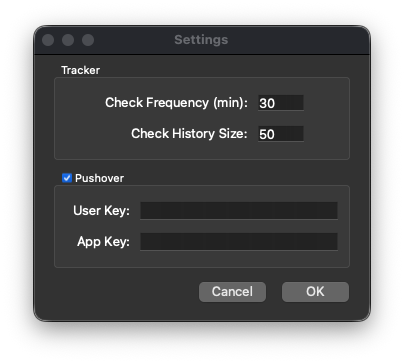
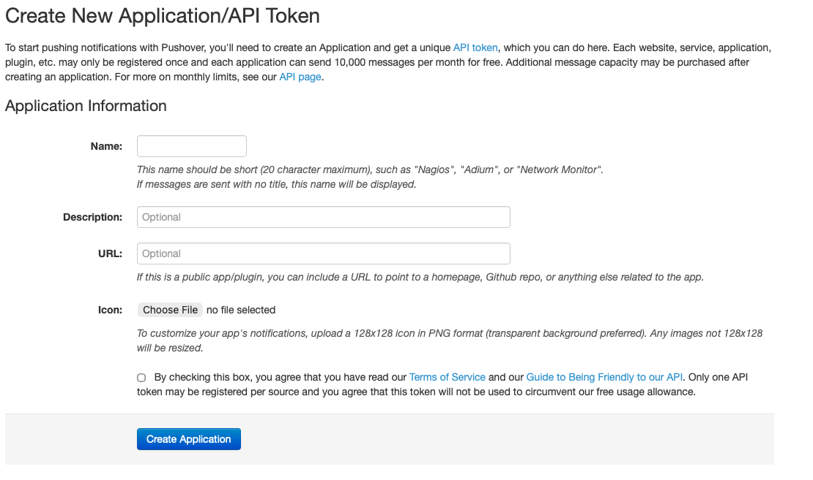

# User Guide

## Installation

### Mac

1. Download latest release app image
2. Add app image to your Applications folder
3. Launch

## UI Elements

Once the app is launch you should see the following tray icon appear:

Clicking on it will bring a context menu which allows you:

* Run manual check for new cards
* Check previous history of checks and their results
* Open settings dialog to adjust app settings
* Quit the application

### Check History

History dialog allows you to double check history of checks that were run in the background.

### Settings

Settings dialog allows to adjust various tracker settings.

### Pushover notifcations

In order to receive push notifications on your phone the following steps are necessary:

1. Register new App on [pushover website](https://pushover.net/apps/build)
2. This should provide you with APP KEY.
3. Using settings dialog copy/paste your APP and USER from pushover website.
4. Install `Pushover` app on your phone
5. If everything is configured correctly you should receive push notification once new cards are released.

> Note:
>
> It's possible to test notifications by doing the following:
>
> * Quit the app if it's running
> * Fake last check date to much older one in `track_data.json`
> * Launch the app and run cards check from tray context menu.

---

> Pushover App:
>
> * [App Store](https://apps.apple.com/gb/app/pushover-notifications/id506088175)
> * [Play Store](https://play.google.com/store/apps/details?id=net.superblock.pushover&hl=en_GB&pli=1)
